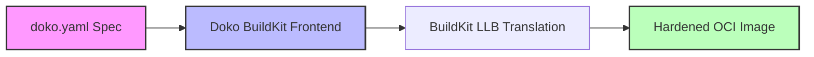

# Doko — Declarative OCI Kit Orchestrator

<p align="center">
  <strong>Declarative, hardened OCI container images — without writing a single Dockerfile.</strong>
</p>

<p align="center">
  <a href="https://github.com/broadsage/doko/actions/workflows/build.yml"></a>
  <a href="https://github.com/broadsage/doko/actions/workflows/verify.yml"></a>
  <a href="https://github.com/broadsage/doko/actions/workflows/test-examples.yml"></a>
  <a href="https://codecov.io/gh/broadsage/doko"></a>
  <a href="https://snyk.io/test/github/broadsage/doko"></a>
  <a href="LICENSE"></a>
  <a href="go.mod"></a>
  <a href="https://github.com/broadsage/doko/releases/latest"></a>
</p>

---

**Doko** is an open-source, next-generation [BuildKit](https://github.com/moby/buildkit) frontend that compiles a simple `doko.yaml` specification directly into a minimal, hardened, policy-compliant OCI container image. 

No more boilerplate Dockerfiles, complex multi-stage shell scripts, or post-build vulnerability scanning workarounds.



## Table of Contents

- [Installation](#installation)
- [Quick Start](#quick-start)
- [Lockfiles (`doko.lock`)](#lockfiles-dokolock)
- [GitHub Action](#github-action)
- [Key Features](#key-features)
- [Project Structure](#project-structure)
- [Development & Contributing](#development--contributing)
- [Security & License](#security--license)

---

## Why Doko?

Traditional Dockerfiles are imperative, prone to security misconfigurations, and difficult to audit. Doko brings declarative clarity to OCI image composition:

| Feature | Dockerfiles | Docker DHI | Chainguard (apko) | **Doko** |
| :--- | :---: | :---: | :---: | :---: |
| **Declarative Spec** | ❌ (Imperative) | ✅ Yes | ✅ | **✅ Yes** |
| **Target OS** | Alpine, Debian, etc. | Alpine, Debian | Wolfi / Alpine | **Alpine** |
| **Multi-Stage Builds** | ✅ | ✅ | ❌ | **✅ Yes (via `outputs:`)** |
| **Negative Packages** | ❌ | ✅ (`!pkg`) | ❌ | **✅ Yes (`!pkg` removal)** |
| **Custom Compilations**| ❌ | ❌ | ❌ | **✅ Yes (native pipeline templates)** |
| **Open Source** | ✅ | ✅ 100% Apache-2.0 | ✅ | **✅ 100% Apache-2.0** |

## Installation

### 1. From Precompiled Binaries
You can download the precompiled binary from the [GitHub Releases](https://github.com/broadsage/doko/releases) page.

### 2. Using Go
If you have Go installed (v1.25+), you can install Doko directly:
```bash
go install github.com/broadsage/doko/cmd/doko@latest
```

### 3. Docker / BuildKit Integration
Doko is designed to run natively as a BuildKit frontend. You do not need to install the binary to build container images; simply point the syntax directive in your `doko.yaml` to the published frontend image:
```yaml
# syntax=ghcr.io/broadsage/doko:latest
```

---

## Quick Start

### 1. Create a `doko.yaml`

```yaml
# syntax=ghcr.io/broadsage/doko:v1

name: secure-web-app

accounts:
  root: false
  run-as: nonroot
  users:
    - name: nonroot
      uid: 65532
      gid: 65532
  groups:
    - name: nonroot
      gid: 65532
      members:
        - nonroot

contents:
  packages:
    - nginx
    - "!telnet"
  paths:
    - type: directory
      path: /var/www/html
      uid: 65532
      gid: 65532
      mode: "0755"

work-dir: /var/www/html
entrypoint: ["nginx", "-g", "daemon off;"]

runtime:
  ports:
    - 8080
```

### 2. Build with Docker Buildx

Run the build command from your terminal:

```bash
docker buildx build -f doko.yaml --tag my-secure-app:latest --load .
```

---

## Lockfiles (`doko.lock`)

To guarantee reproducible builds, Doko supports package lockfiles. If a `doko.lock` file is present in the build context, Doko will enforce the exact versions specified in the lockfile rather than fetching the latest available versions from the repository indices.

Example `doko.lock`:
```yaml
provider: apk
arch: amd64
packages:
  - name: nginx
    version: 1.26.3-r0
  - name: curl
    version: 8.5.0-r0
```

---

## GitHub Actions CI/CD Integration

Doko can be easily integrated into your GitHub Actions pipelines using the official Docker `build-push-action`.

Simply point the `file` parameter to your `doko.yaml` configuration:

```yaml
steps:
  - uses: actions/checkout@v4
  
  - name: Set up QEMU
    uses: docker/setup-qemu-action@v3
    
  - name: Set up Docker Buildx
    uses: docker/setup-buildx-action@v3

  - name: Build and Load Image
    uses: docker/build-push-action@v6
    with:
      context: .
      file: 'doko.yaml'
      tags: 'my-secure-app:latest'
      load: true
```

---

## Key Features

### 🛡️ Default Secure-by-Design
> [!IMPORTANT]
> By default, setting `accounts.root: false` completely purges the root user and group from `/etc/passwd` and `/etc/group`, eliminating UID 0 privilege escalation attacks entirely.

### 📦 Negative Package Trimming
Remove dangerous or unneeded system packages from base environments explicitly:
```yaml
contents:
  packages:
    - nginx
    - "!telnet"
    - "!gawk"
```

### 🔀 Multi-Stage Sub-Builds
Compile artifacts in isolated builder stages and transfer outputs cleanly:
```yaml
builds:
  - name: app-builder
    outputs:
      - source: /usr/local/bin/app
        target: /usr/local/bin/app
    contents:
      packages:
        - go
      pipeline:
        - name: compile
          runs: go build -o /usr/local/bin/app ./cmd/app
```

### ⚙️ Custom Package Compilation
Build specialized packages using reusable steps/templates (`fetch`, `configure`, `make`, `install`) directly inside your image pipeline:
```yaml
builds:
  - name: my-custom-pkg
    version: "1.2.3"
    license: MIT
    pipeline:
      - uses: fetch
        with:
          uri: https://example.com/src.tar.gz
      - uses: configure
      - uses: make
      - uses: install
```

### 🌐 OCI-Native Layout & Import
Pull files directly from external OCI images without configuring secondary stages:
```yaml
artifacts:
  - name: ghcr.io/your-org/gosu:1.17
    includes:
      - /usr/local/bin/gosu
```

---

## Project Structure

```
cmd/doko/           — BuildKit frontend entrypoint CLI
docs/               — Schema guidelines and release documentation
examples/           — Reference builds (Nginx, PostgreSQL, Redis, Python API)
hack/               — Developer scripts (make-dev.sh, make-image.sh)
internal/
  builder/          — BuildKit client session gateway orchestrator
  config/           — YAML parsing, schema definition, and validation
  llb/              — BuildKit Low-Level Builder (LLB) generation
  pipeline/         — Reusable build pipeline and variable template engine
  providers/        — Unified provider registry (Apk builders & resolvers)
  utils/            — Common helpers (strings, BuildKit integration)
```

---

## Development & Contributing

We welcome community contributions. Detailed workflow information is available in [CONTRIBUTING.md](CONTRIBUTING.md).

### Quick Reference (using Taskfile)

```bash
# Spin up the containerised development workspace
task devenv

# Common Tasks
task generate         # Regenerate schema.json from Go structs
task build            # Compile local binary
task test             # Run test suite
task lint             # Verify code quality via golangci-lint
task test-example     # Run end-to-end spec compilation tests
```

---

## Security & License

* **Security Vulnerabilities**: If you find a security issue, please report it privately via [GitHub Security Advisories](https://github.com/broadsage/doko/security/advisories/new) instead of opening public issues.
* **License**: This project is licensed under the Apache-2.0 License. See the [LICENSE](LICENSE) file for details.
